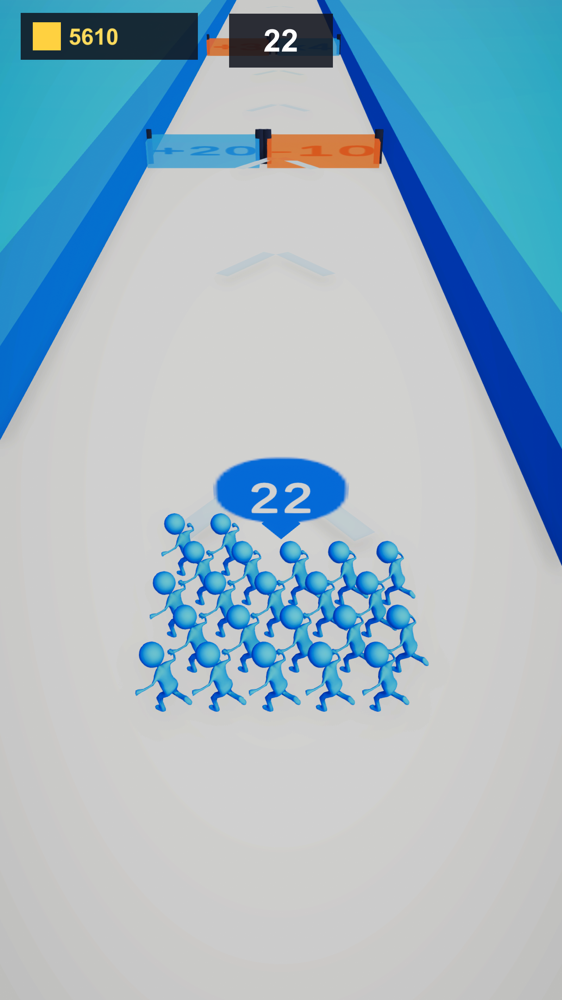
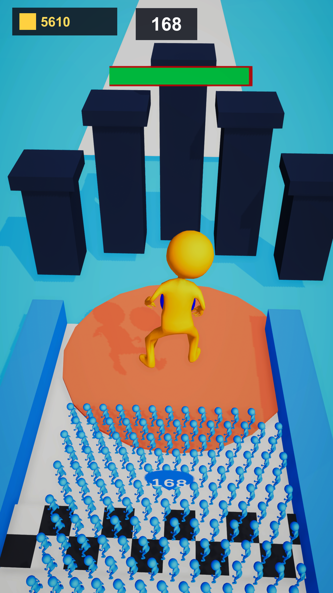
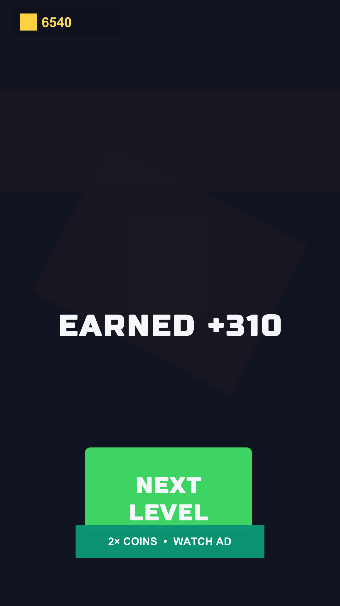
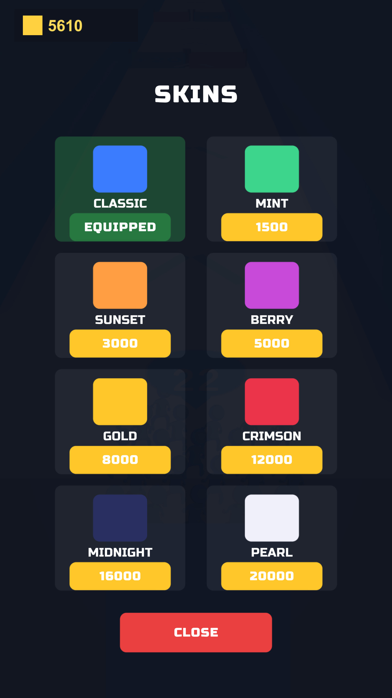

# crowd-runner-clone
Clone of Crowd Runner game. Made with Unity

Example gameplay can be found here: https://www.youtube.com/watch?v=1TBkmRBn8ws&t=1s

## About The Project

https://user-images.githubusercontent.com/74188001/184542351-73e1afe1-ae8b-4acd-b2ad-1fafee8c18bb.mov

This is the clone of the Crowd Runner 3D hypercasual genre game made with Unity, without assets only codebase available.

### Current Build (2026-07-21)

Screenshots from the current build, for comparison against the clip above:

   

### Featuers Included:
Touch Controls
Crowd Control
Tweening
Haptics
